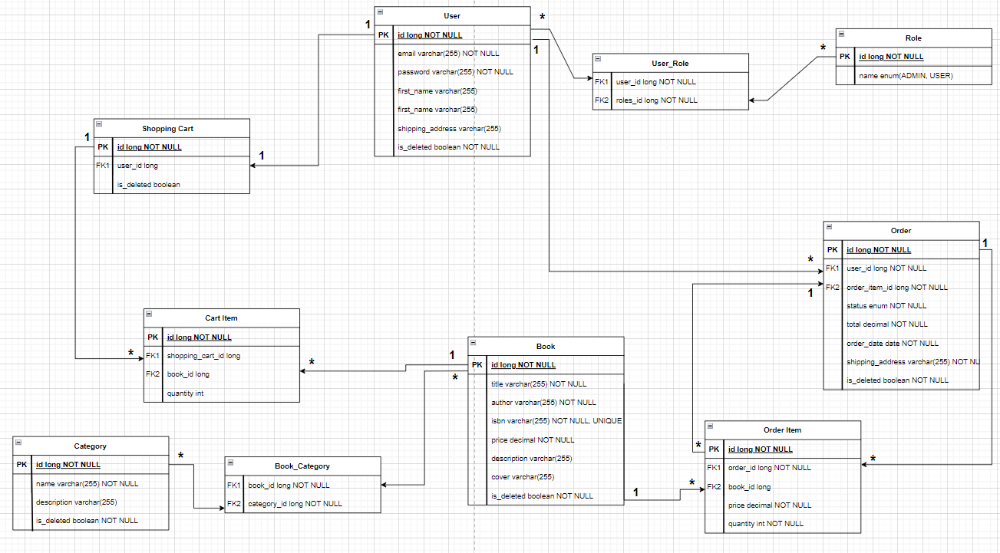

**📖 Book Buying Service 📖**

Book-Buying-Service is an innovative RESTful web application tailored to buy books. Developed using Spring Boot and Java, the application strictly follows the principles of the REST architectural style, ensuring stateless communication between clients and the server. With easy registration and login processes, users can access the platform using their credentials. Notably, the application implements role-based authorization for administrators and regular users, enhancing security.

Book-Buying-Service stands out as a contemporary and efficient tool for book buying, delivering speed, security, and convenience to all its valued users.

**🌐 Functionality 🌐**

User registration, login, and role-based authorization: Allows different user levels to have appropriate access and capabilities within the service.

#### Request Body for registration

<details>
<summary>Click to see</summary>

```
{
  "email": "john@example.com",
  "password": "12345678",
  "repeatPassword": "12345678",
  "firstName": "John",
  "lastName": "Doe",
  "shippingAddress": "123 Main St, City, Country",
  "roles": ["USER", "ADMIN"]
}

```
</details>

#### Request Body for login

<details>
<summary>Click to see</summary>

```
{
  "email": "john@example.com",
  "password": "12345678"
}

```
</details>

Multiple endpoints with user and admin access: Enables different functionalities and operations for both users and administrators

In app we can:

Add, update and delete books. Also, we can get all books, get book one by ID and get all books by specification.

#### Request Body to save/change book

<details>
<summary>Click to see</summary>

```
{
    "title": "The Adventures of Tom Sawyer",
    "author": "Mark Twain",
    "isbn": "87782224221744222",
    "price": 54.99,
    "description": "Another sample book description.",
    "coverImage": "http://example.com/cover2.jpg",
    "categories": [1, 2]
}

```
</details>

You can assign categories to each book. 

#### Request Body to save/change book category

<details>
<summary>Click to see</summary>

```
{
    "name": "Comedy",
    "description": "makes smile"
}

```
</details>

It is possible to create an order for an authenticated user, it is possible to add OrderItems and Cart Items, where you can specify the ID of the book and quantity of books in the order

#### Request Body to save cart item in shopping cart

<details>
<summary>Click to see</summary>

```
{
    "bookId": 1,
    "quantity": 10
}

```
</details>

#### Request Body to change cart item in shopping cart

<details>
<summary>Click to see</summary>

```
{
    "quantity": 10
}

```
</details>

#### Request Body to save order item for authorized user

<details>
<summary>Click to see</summary>

```
{
  "shippingAddress": "Kyiv, Shevchenko ave, 1"
}

```
</details>

#### Request Body to change order item for authorized user

<details>
<summary>Click to see</summary>

```
{
    "status": "CANCELLED"
}

```
</details>

Also, each user has his own shopping card, where all the user's orders are visible, and you can change status of the order, for example (PENDING, CANCELED etc...)

**↗️ Project structure ↗️**

The project follows a 3-layer architecture:

**Presentation layer (controllers)**

**Application layer (services)**

**Data access layer (repositories)**

The project has the following package structure:

Config: It is responsible for configuring the security rules and access restrictions for different endpoints of the application using the Spring Security framework.

Controllers: Contains controllers for handling endpoints.

Dto: Data transfer objects for transferring data between layers.

Exception: Contains exception classes for handling errors within the project.

Model: Stores information about entities and their properties.

**💫 Technologies 💫**

Java 17

Spring Boot 3.2.3

Springdoc OpenAPI (Swagger) 2.1.0

Liquibase 4.24.0

MySQL

Lombok 1.18.20

MapStruct 1.5.5.Final

jjwt 0.11.5

Docker 25.0.3

Apache Maven 3.1.2

JUnit 4.13.2

TestContainers 1.19.7

**🏃 How to run app 🏃**

Clone this project from GitHub

Install Postman for sending requests

Create an empty database using a local installation of MySQL

Open the project in your preferred Integrated Development Environment.

Locate the application.properties and liquibase.properties in the project. It should contain the database connection settings. Enter the appropriate values in the appropriate fields.

Configure Docker (read below how)

**🐬How to configure Docker🐬**

Install DOCKER DESKTOP from https://www.docker.com/products/docker-desktop/ and follow the setup steps

Create an .env file at the project level and insert the necessary information using the template:

*MYSQLDB_USER=YOUR_USER_NAME* 

*MYSQLDB_ROOT_PASS=YOUR_PASSWORD* 

*MYSQLDB_DATABASE=YOUR_DATABASE* 

*MYSQLDB_LOCAL_PORT=3307*

*MYSQLDB_DOCKER_PORT=3306* 

*SPRING_LOCAL_PORT=8080* 

*SPRING_DOCKER_PORT=8081*

### Run the following 3 commands in the terminal:

*“mvn clean package”*

*“docker build -t bookapp:latest .”*

*Run project by running the command "docker-compose up"!*


## Class diagram


